# Uzbekistan Payment Platform — Database Schema (Reviewed & Extended)

*Reviewed against the research report "Uzbekistan P2P/P2A/B2B/B2C/C2B Payment Architecture" (current as of July 30, 2026). Original schema translated into English, every table and field annotated, and gaps identified by the research closed with new tables/fields (marked 🆕‑R for "added during this review").*

---

## 0. What changed in this review

The original schema was already excellent — it correctly anticipated and pre-implemented most of the research report's recommendations (the `parties`/`instruments` supertype model, `banks`, `payment_networks`, `transfer_types`, `purpose_codes`, staged merchant/business/settlement tables). The gaps below are the remaining items the research report calls out that the schema did not yet cover:

| # | Gap found | Why it matters | Fix applied |
|---|---|---|---|
| 1 | **No table backs `admins`.** Nine different columns (`created_by_admin_id`, `verified_by_admin_id`, `resolved_by_admin_id`, etc.) store a bare `UUID` with no foreign key, so referential integrity, "who did what," and access control for staff are not enforceable at the database level. | Every compliance/audit workflow (KYB approval, limit overrides, reconciliation resolution) depends on knowing which staff member acted, and needs to be revocable/auditable. | 🆕‑R `admins` table (Section 15) + all `*_admin_id` columns now reference it. |
| 2 | **No versioned store for regulatory constants.** The research report is explicit that the Base Calculation Value (412,000 UZS from 1 Aug 2025), the AML one-off threshold (175,000,000 UZS from 9 Aug 2026), the enhanced-info threshold (25 BCV), and the large-operation monitoring thresholds (500/1000 BCV) "must be stored as versioned config, not hardcoded," and that they "change quickly in 2026." The current schema has no such table — these numbers would end up hardcoded in application code. | Wrong or stale thresholds create real legal exposure (incorrect AML/CDD triggers) and every value already changed at least once in 2025–2026. | 🆕‑R `regulatory_parameters` table (Section 15). |
| 3 | **No compliance/monitoring case table.** `limit_rules` (with `limit_category='regulatory_limit'`) models *ceilings*, but the AML large-operation **monitoring** obligations (flag and review a transfer/customer, not block it) have nowhere to live. | Regulatory thresholds like the 175M one-off CDD trigger and the 500/1000 BCV suspicious-activity triggers require a *review workflow* (flag → investigate → report/dismiss), which is a different lifecycle than a hard limit. | 🆕‑R `compliance_flags` table (Section 15). |
| 4 | **`instruments.instrument_type` allows `'qr'` and `'payment_link'`, but only `cards`, `bank_accounts`, and `merchant_accounts` exist as subtype tables.** A QR code or payment link created today would have no place to store its payload, its static/dynamic distinction, its linked merchant account, or its expiry. | UzQR (mandatory for merchants from 1 July 2026, per the research) is explicitly a Stage 2 requirement, and the schema already reserves the enum value — the subtype table was simply missing. | 🆕‑R `qr_codes` and `payment_links` tables (Section 2). |
| 5 | **No `channel` dimension on `transfers`.** The research report recommends keeping `channel` (`mobile_app`\|`pos`\|`e_pos`\|`api`) as an orthogonal column, separate from `transfer_type`/`instrument_type`. This also gives a clean, queryable way to enforce the hard invariant *"P2P transfers over a website are prohibited"* instead of leaving it purely as unenforced application logic. | Needed for C2B reporting (POS vs e-POS vs QR-in-app) and to make the website-prohibition rule auditable. | 🆕‑R `channel` column added to `transfers`. |
| 6 | **`cards` has no linkage for a Special Card Account (SCA).** The research report's "Modify" list for `cards` calls out adding SCA linkage; special/restricted-purpose card accounts (used for some salary, benefit, and promotional programs in Uzbekistan) were not represented. | Needed once payroll/benefit card products are supported (Stage 3, B2C). | 🆕‑R `is_special_card_account` + `sca_purpose` columns added to `cards`. |
| 7 | **Minor:** `currency_code CHAR(3)` is repeated as free text on ~10 tables with no lookup/enforcement table. | Low priority — the platform is UZS-only today and the research report explicitly warns against over-engineering ("do NOT add tables the flow doesn't require yet"). | **Not added as a table** — flagged here only as a future, low-priority nice-to-have (a `currencies` lookup with `decimal_places`) if multi-currency is ever scoped. |

Everything else in the document below is the original schema, translated in full into English, with every table and every field given an explicit description (previously some rationale was only at the table level).

---

## 1. Identity — 6 tables (was 5)

### `users` — Stage 1 (subtype of `parties`)
**Why it's needed:** Core identity — every card, transfer, and session hangs off this row. The research confirms that in Uzbekistan a natural person (Person), an individual entrepreneur (ИП), and a legal entity (business) go through separate KYC/KYB forms, so `users` is scoped to **natural persons only**; businesses/IEs get their own `businesses` table (Section 13).

| Field | Type | Description |
|---|---|---|
| id | UUID PK, FK → parties(id) | Shared primary key — the user simultaneously has a row in `parties` with `party_type='person'` (see Section 2). |
| phone_e164 | VARCHAR(16) UNIQUE NOT NULL | Primary login/identification credential, in E.164 format. |
| full_name | TEXT | Display name; compared against the cardholder name printed on linked cards. |
| status | VARCHAR(20) DEFAULT 'pending' | `pending`\|`active`\|`suspended`\|`closed` — governs whether the user is currently allowed to transact. |
| kyc_level | VARCHAR(20) DEFAULT 'basic' NOT NULL | `basic`\|`verified`\|`premium` — drives `limit_rules.kyc_tier` and the new AML thresholds (e.g. the 175M UZS one-off due-diligence trigger effective 9 Aug 2026 — now versioned in `regulatory_parameters`, see Section 15). |
| biometric_verified_at | TIMESTAMPTZ NULLABLE | Per the Central Bank's 2026 draft rule, remote biometric identification may become mandatory at app registration — timestamp of that verification. |
| created_at | TIMESTAMPTZ | Row creation time. |
| updated_at | TIMESTAMPTZ | Last modification time. |
| closed_at | TIMESTAMPTZ | Soft-close marker; never hard-delete a user row. |
| version | INT DEFAULT 0 | Optimistic-locking counter for status transitions. |

### `devices` — Stage 1
**Why it's needed:** Device fingerprinting is the cheapest fraud signal available (new device + login shortly followed by a large transfer is the classic account-takeover pattern).

| Field | Type | Description |
|---|---|---|
| id | UUID PK | Row identifier. |
| user_id | UUID FK → users | Owning user. |
| device_fingerprint | TEXT | OS-level device identifier. |
| platform | VARCHAR(10) | `ios`\|`android`. |
| push_token | TEXT | Token used to deliver transaction push notifications. |
| first_seen_at | TIMESTAMPTZ | First time this device was observed. |
| last_seen_at | TIMESTAMPTZ | Most recent activity — feeds staleness/anomaly checks. |
| trusted | BOOLEAN DEFAULT false | Set to `true` after the first OTP-confirmed transfer from this device. |

### `sessions` — Stage 1
**Why it's needed:** Login state — fraud review and forced logout both need to know which device authorized a given transfer.

| Field | Type | Description |
|---|---|---|
| id | UUID PK | Session identifier used by issued tokens. |
| user_id | UUID FK → users | Owning user. |
| device_id | UUID FK → devices | Device that opened this session. |
| ip_address | INET | Login IP, used for anomaly detection. |
| created_at | TIMESTAMPTZ | Session start. |
| expires_at | TIMESTAMPTZ | Forces re-authentication. |
| revoked_at | TIMESTAMPTZ | Set on manual or forced logout. |

### `refresh_tokens` — Stage 1
**Why it's needed:** Avoids forcing a full re-login every time the app is opened.

| Field | Type | Description |
|---|---|---|
| id | UUID PK | Row identifier. |
| user_id | UUID FK → users | Owning user. |
| token_hash | TEXT | Hash of the token — never store the raw token. |
| session_id | UUID FK → sessions | Ties token rotation to a specific session. |
| expires_at | TIMESTAMPTZ | Expiry time. |
| revoked_at | TIMESTAMPTZ | Set in response to a detected compromise. |

### `otp_codes` — Stage 1
**Why it's needed:** Step-up authentication for login and transfers. Per the research, **every P2P transfer must be OTP-confirmed, and P2P transfers initiated from a website are prohibited outright** — this is enforced as a hard application-level invariant and tracked via `otp_codes.purpose='transfer'`.

| Field | Type | Description |
|---|---|---|
| id | UUID PK | Row identifier. |
| user_id | UUID FK → users | Recipient of the code. |
| purpose | VARCHAR(20) | `login`\|`transfer`\|`card_add` — what this code is allowed to confirm. |
| code_hash | TEXT | Hash of the code — never store the plaintext code. |
| target_id | UUID | Reference to the transfer/card-add operation being confirmed. |
| expires_at | TIMESTAMPTZ | Typically 2–5 minutes. |
| consumed_at | TIMESTAMPTZ | Prevents code reuse. |
| attempt_count | SMALLINT DEFAULT 0 | Locks out brute-force attempts. |

### `admins` 🆕‑R — Stage 1
**Why it's needed:** Closes gap #1. Every staff action currently recorded elsewhere as a bare `admin_id` column (fee-rule changes, limit overrides, KYB document verification, reconciliation resolution, compliance-flag resolution) needs a real, permissioned, auditable identity behind it.

| Field | Type | Description |
|---|---|---|
| id | UUID PK | Row identifier — referenced by every `*_admin_id` column elsewhere in the schema. |
| full_name | TEXT NOT NULL | Staff member's name. |
| email | VARCHAR(255) UNIQUE NOT NULL | Login/identification credential. |
| role | VARCHAR(20) CHECK IN ('support','compliance','finance','risk','super_admin') NOT NULL | Coarse-grained permission group; fine-grained permissions live in application logic. |
| status | VARCHAR(15) CHECK IN ('active','suspended') DEFAULT 'active' | Whether this staff account can currently act. |
| created_at | TIMESTAMPTZ | Row creation time. |
| last_login_at | TIMESTAMPTZ NULLABLE | Last successful admin login — useful for access reviews. |

---

## 2. Parties and Instruments — Supertype Model — 5 tables (was 3)

**Why it's needed (architecture history):** The `transfers` table originally carried a separate nullable FK for every sender/recipient type (`sender_user_id`, `sender_card_id`, `sender_business_id`, `sender_bank_account_id`, `recipient_card_id`, `recipient_business_id`, `recipient_bank_account_id`, `merchant_account_id`). This caused two problems: (1) most columns on any given row were NULL, and nothing guaranteed "exactly one source is filled in"; (2) adding a new party/instrument type (e.g. wallet, QR, payment link) meant adding two more columns and a new CHECK every time — this does not scale.

**Solution — two "supertype" tables (class-table inheritance):**
- **`parties`** — "who owns the money" (person\|business\|merchant); `users`, `businesses`, `merchants` are now subtypes sharing a primary key with `parties.id`.
- **`instruments`** — "where the money technically sits" (card\|bank_account\|merchant_account\|qr\|payment_link); `cards`, `bank_accounts`, `merchant_accounts`, and now `qr_codes`/`payment_links` are subtypes sharing a primary key with `instruments.id`.

### `parties`
**Why it's needed:** Represents the generic fact "someone sent/received money" — whether that someone is a person, a business, or a merchant — in one place with a real FK. `transfer_participants.party_id` points here without needing to know which of `users`/`businesses`/`merchants` it resolves to.

| Field | Type | Description |
|---|---|---|
| id | UUID PK | Shared with `users.id`, `businesses.id`, or `merchants.id` (subtype pattern). |
| party_type | VARCHAR(10) CHECK IN ('person','business','merchant') NOT NULL | Tells you which subtype table to join to. |
| created_at | TIMESTAMPTZ | Row creation time. |

### `instruments`
**Why it's needed:** Represents the generic fact "money sits in this technical vehicle" — card, bank account, or merchant account — in one place, with real FK ownership (`owner_party_id`). Critically, `UNIQUE (id, owner_party_id)` lets `transfer_participants` enforce "this instrument really belongs to this party" via a plain composite foreign key, with no trigger needed.

| Field | Type | Description |
|---|---|---|
| id | UUID PK | Shared with `cards.id`, `bank_accounts.id`, `merchant_accounts.id`, `qr_codes.id`, or `payment_links.id` (subtype pattern). |
| owner_party_id | UUID FK → parties NOT NULL | Which party owns this instrument. |
| instrument_type | VARCHAR(20) CHECK IN ('card','bank_account','merchant_account','qr','payment_link') NOT NULL | Tells you which subtype table to join to. |
| status | VARCHAR(15) CHECK IN ('active','removed','blocked') DEFAULT 'active' | Current usability of the instrument. |
| created_at | TIMESTAMPTZ | Row creation time. |
| removed_at | TIMESTAMPTZ NULLABLE | Soft delete — an instrument used in historical transfers is never hard-deleted. |
| — | UNIQUE (id, owner_party_id) | Required for the composite FK described below. |

### `transfer_participants` — replaces every nullable sender_*/recipient_* column that used to live on `transfers`
**Why it's needed:** `sender_user_id`, `sender_card_id`, `sender_business_id`, `sender_bank_account_id`, `recipient_card_id`, `recipient_business_id`, `recipient_bank_account_id`, `merchant_account_id`, `payment_method`, and `destination_type` were **removed** from `transfers` (see Section 4) — they are now represented as exactly two rows per transfer (`sender`, `recipient`) here, each with a real FK to a party and an instrument. This keeps `transfers` permanently narrow: adding a new party/instrument type is a data change, not a schema change.

| Field | Type | Description |
|---|---|---|
| id | UUID PK | Row identifier. |
| transfer_id | UUID FK → transfers NOT NULL | Parent transfer. |
| role | VARCHAR(10) CHECK IN ('sender','recipient') NOT NULL | Which side of the transfer this row represents. |
| party_id | UUID FK → parties NOT NULL | Who (person/business/merchant) — KYC/AML/limit checks hang off this column. |
| party_type | VARCHAR(10) CHECK IN ('person','business','merchant') NOT NULL | Denormalized from `parties.party_type` for join-free filtering. |
| instrument_id | UUID FK → instruments NOT NULL | Which card/bank account/merchant account was used — routing/network/fee logic hangs off this column. |
| instrument_type | VARCHAR(20) CHECK IN ('card','bank_account','merchant_account','qr','payment_link') NOT NULL | Denormalized from `instruments.instrument_type`; replaces the old `transfers.payment_method`/`destination_type` (kept per-side, since e.g. a P2A transfer can be card→account). |
| created_at | TIMESTAMPTZ | Row creation time. |
| — | UNIQUE (transfer_id, role) | Guarantees exactly one sender row and one recipient row per transfer. |
| — | FOREIGN KEY (instrument_id, party_id) REFERENCES instruments (id, owner_party_id) | **Composite FK** — enforces "this instrument really belongs to this party" purely relationally, without a trigger (e.g. one user cannot claim another user's card as their own). |

*Additional rule (trigger-enforced):* `transfer_types` gains `allowed_sender_party_types`/`allowed_recipient_party_types` array columns (e.g. `{person}`/`{person}` for P2P, `{person}`/`{merchant}` for C2B), and a `BEFORE INSERT` trigger on `transfer_participants` enforces them — this crosses two tables (`transfers.transfer_type_id` + `transfer_participants.party_type`), so a plain `CHECK` cannot express it (PostgreSQL `CHECK` cannot reference another table).

### `qr_codes` 🆕‑R (subtype of `instruments`, `instrument_type='qr'`)
**Why it's needed:** Closes gap #4. UzQR is mandatory for merchants from 1 July 2026 and the schema already reserved `instrument_type='qr'` for it, but had no table to store the QR payload, its static/dynamic distinction, or its optional pre-filled amount.

| Field | Type | Description |
|---|---|---|
| id | UUID PK, FK → instruments(id) | Shared primary key — owner (always the merchant) is stored on `instruments.owner_party_id`. |
| merchant_account_id | UUID FK → merchant_accounts NOT NULL | Which merchant settlement account this QR credits. |
| qr_type | VARCHAR(10) CHECK IN ('static','dynamic') NOT NULL | Static = reusable, printed code; dynamic = generated per-transaction. |
| payload | TEXT NOT NULL | The encoded QR content per the UzQR/MUNIS standard. |
| amount | BIGINT NULLABLE | Pre-filled amount for dynamic QR codes; NULL for static/buyer-entered amount. |
| expires_at | TIMESTAMPTZ NULLABLE | Expiry for dynamic QR codes; NULL for static codes. |
| created_at | TIMESTAMPTZ | Row creation time. |

### `payment_links` 🆕‑R (subtype of `instruments`, `instrument_type='payment_link'`)
**Why it's needed:** Closes gap #4. Reserved as a Phase 2 acceptance method alongside UzQR (per the research report's C2B recommendations); the enum value existed with no backing table.

| Field | Type | Description |
|---|---|---|
| id | UUID PK, FK → instruments(id) | Shared primary key — owner (the merchant) is stored on `instruments.owner_party_id`. |
| merchant_account_id | UUID FK → merchant_accounts NOT NULL | Which merchant settlement account this link credits. |
| amount | BIGINT NULLABLE | Fixed amount if set by the merchant; NULL if the payer enters the amount. |
| currency_code | CHAR(3) DEFAULT 'UZS' | Settlement currency. |
| status | VARCHAR(12) CHECK IN ('active','expired','used','canceled') DEFAULT 'active' | Current usability of the link. |
| expires_at | TIMESTAMPTZ NULLABLE | Optional expiry. |
| created_at | TIMESTAMPTZ | Row creation time. |

---

## 3. Cards — 2 tables

### `cards` — Stage 1 (rebuilt as a subtype of `instruments`)
**Why it's needed:** The platform's primary source/destination of funds. **Key change:** `cards.id` is no longer an independent UUID but shares a primary key with `instruments.id` (class-table inheritance) — so the `user_id` column was removed; ownership is now expressed via `instruments.owner_party_id`. Because UzCard and Humo are separate, independent payment organizations, the card records exactly which bank (issuer) and which payment network issued it via real FKs.

| Field | Type | Description |
|---|---|---|
| id | UUID PK, FK → instruments(id) | Shared primary key — this row also exists in `instruments` (subtype pattern). |
| ~~user_id~~ | *(removed)* | Now expressed via `instruments.owner_party_id` — see Section 2. |
| card_token | VARCHAR(128) NOT NULL | Processor/network token — the actual credential that moves money. |
| masked_pan | VARCHAR(19) NOT NULL | Display-only (first 6 + last 4 digits). |
| card_network | VARCHAR(10) CHECK IN ('uzcard','humo') | Routes the transfer to the correct network integration (kept for fast filtering). |
| payment_network_id | INT FK → payment_networks NULLABLE | Normalized version of `card_network` — UzCard/Humo fee, limit, and routing rules hang off this FK. |
| issuer_bank_id | UUID FK → banks NULLABLE | Bank that issued the card — bank-level limits (e.g. Kapitalbank's 10M UZS/month fee-free limit) attach to the bank, not the network. |
| card_holder_name | TEXT | If the card belongs to a registered user, compared against the owner's `full_name`. |
| exp_month | SMALLINT | Card expiry month. |
| exp_year | SMALLINT | Card expiry year. |
| status | VARCHAR(12) DEFAULT 'unverified' | `unverified`\|`verified`\|`expired`\|`blocked`. |
| verified_at | TIMESTAMPTZ | Set after a successful micro-payment/OTP verification. |
| is_default | BOOLEAN DEFAULT false | Each owner has one default sending card. |
| is_special_card_account 🆕‑R | BOOLEAN DEFAULT false | Marks a Special Card Account (SCA) — a restricted-purpose card used for some salary/benefit/promotional programs (closes gap #6). |
| sca_purpose 🆕‑R | VARCHAR(30) NULLABLE | Purpose of the SCA restriction, e.g. `payroll`\|`benefit`\|`promotional`; NULL when `is_special_card_account=false`. |

*Note:* `created_at`/`removed_at` (soft delete) now live on the supertype `instruments` table and are not duplicated on the subtype.

### `saved_recipient_cards` — Stage 1
**Why it's needed:** An address book of previously used cards — lets a sender pick "Mom's card" instead of retyping a 16-digit number every time. *Note:* the Stage 3 `beneficiaries` table (Section 13) stores both cards and bank accounts through a single `instrument_id` column via the `instruments` supertype; `saved_recipient_cards` remains unchanged regardless, because card-specific display fields (e.g. `masked_pan`) are kept separate for MVP speed.

| Field | Type | Description |
|---|---|---|
| id | UUID PK | Row identifier. |
| owner_user_id | UUID FK → users | Who this address-book entry belongs to. |
| masked_pan | VARCHAR(19) | Display-only. |
| card_token | VARCHAR(128) | Token used to initiate a transfer to this card. |
| card_network | VARCHAR(10) CHECK IN ('uzcard','humo') | Routes the transfer correctly. |
| label | TEXT | User-assigned nickname. |
| last_used_at | TIMESTAMPTZ | Powers "recently used recipients" ordering. |
| created_at | TIMESTAMPTZ | Row creation time. |

---

## 4. Transfers — 2 tables

### `transfers` — Stage 1
**Why it's needed:** The business-level record of a single movement of money. **Architecture note:** the columns originally added here (`sender_user_id`, `sender_card_id`, `recipient_card_id`, `sender_business_id`, `recipient_business_id`, `sender_bank_account_id`, `recipient_bank_account_id`, `merchant_account_id`, `payment_method`, `destination_type`) were **entirely removed** — in practice most of them were NULL on every row, and nothing guaranteed "exactly one source is filled in." They are replaced by the **`transfer_participants`** table (Section 2) — exactly two rows per transfer (`sender`, `recipient`), each with a real FK to a party and an instrument. As a result `transfers` stays **permanently narrow**: adding a new actor or instrument type never requires a new column here.

| Field | Type | Description |
|---|---|---|
| id | UUID PK | Row identifier. |
| amount | BIGINT CHECK (amount > 0) | Requested amount, in the smallest currency unit (tiyin). |
| fee_amount | BIGINT DEFAULT 0 | Final commission computed via `fee_rules`; which rule was used is stored in `applied_fee_rule_id`. |
| currency_code | CHAR(3) DEFAULT 'UZS' | Settlement currency. |
| status | VARCHAR(16) DEFAULT 'initiated' | `initiated`\|`otp_pending`\|`processing`\|`completed`\|`failed`\|`reversed`. |
| idempotency_key | VARCHAR(64) UNIQUE | Prevents a duplicate transfer on client retry. |
| network_reference | VARCHAR(64) | UzCard/Humo's own transaction reference — needed for reconciliation. |
| applied_fee_rule_id | UUID FK → fee_rules, NULLABLE | Which fee rule applied at transfer time — kept so historical calculations can be audited even after the tariff changes. |
| applied_route_id | UUID FK → transfer_routes, NULLABLE | Which route the transfer was sent over. |
| transfer_type_id | INT FK → transfer_types NOT NULL DEFAULT 1 (P2P) | Which business relationship this transfer belongs to (P2P/P2A/B2B/B2C/C2B) — limit, fee, and routing rules hang off this column. |
| purpose_code_id | INT FK → purpose_codes NULLABLE | The mandatory 16-item "transfer purpose" required for P2P per the Central Bank's 17 Feb 2026 letter — enforced by application logic since it is a bank/PSP-level requirement. |
| channel 🆕‑R | VARCHAR(12) CHECK IN ('mobile_app','pos','e_pos','api','web') DEFAULT 'mobile_app' NOT NULL | Kept as an orthogonal dimension from `transfer_type`/`instrument_type` per the research recommendation — also makes the hard invariant "P2P over a website is prohibited" a checkable, auditable value instead of unenforced logic (closes gap #5). |
| initiated_at | TIMESTAMPTZ | When the transfer was created. |
| completed_at | TIMESTAMPTZ | When the transfer reached a terminal state. |

**Who sent/received, and with what instrument?** → `SELECT * FROM transfer_participants WHERE transfer_id = ...` (filter by role `sender`/`recipient`). See Section 2.

*Note:* `payment_method` and `destination_type` were also removed — they are now expressed via `transfer_participants.instrument_type` (stored per side, join-free), since the two sides of one transfer can be different instrument types (e.g. P2A: card → bank account).

### `transfer_status_history` — Stage 1
**Why it's needed:** Card-to-card transfers pass through several asynchronous states (OTP → processing → confirmation); support needs the full timeline, not just the current status.

| Field | Type | Description |
|---|---|---|
| id | UUID PK | Row identifier. |
| transfer_id | UUID FK → transfers | Parent transfer. |
| from_status | VARCHAR(16) | Prior status. |
| to_status | VARCHAR(16) | New status. |
| reason | TEXT | E.g. "network timeout," "OTP confirmed." |
| changed_at | TIMESTAMPTZ | When the transition happened. |

---

## 5. Network — 3 tables

### `transactions` — Stage 1 (`payment_network_id`) / Stage 2 (`settlement_batch_id`)
**Why it's needed:** One row per actual call made to the card system (debit leg, credit leg) — kept separate from the user-facing `transfers` row because a single transfer may require a network-level retry or reversal.

| Field | Type | Description |
|---|---|---|
| id | UUID PK | Row identifier. |
| transfer_id | UUID FK → transfers | Parent business event. |
| transaction_type_id | INT FK → transaction_types | `debit_leg`\|`credit_leg`\|`reversal`. |
| card_id | UUID FK → cards | Which card this network call touched. |
| amount | BIGINT | Amount of this leg. |
| network_status_code | VARCHAR(20) | Raw response code from UzCard/Humo, for debugging. |
| failure_reason_id | INT FK → transaction_failure_reasons, NULLABLE | Set when `status = failed`. |
| status | VARCHAR(16) | `pending`\|`success`\|`failed`. |
| processed_at | TIMESTAMPTZ | When the network responded. |
| payment_network_id | INT FK → payment_networks NULLABLE | Since UzCard/Humo clearing is **net/deferred** (per operational day) rather than real-time, each transaction needs to know which network's operational day it belongs to. |
| settlement_batch_id | UUID FK → settlement_batches NULLABLE | Which settlement batch this transaction was included in — populated once the merchant/C2B flow arrives (Stage 2). |

### `transaction_types` — Stage 1

| Field | Type | Description |
|---|---|---|
| id | SERIAL PK | Row identifier. |
| code | VARCHAR(20) | `debit_leg`\|`credit_leg`\|`reversal`. |

### `transaction_failure_reasons` — Stage 1
**Why it's needed:** Normalizes the dozens of raw decline codes returned by card networks into something both user-displayable and trackable for systemic issues (e.g. the Humo API being down).

| Field | Type | Description |
|---|---|---|
| id | SERIAL PK | Row identifier. |
| network_code | VARCHAR(20) | Raw code from UzCard/Humo. |
| normalized_reason | VARCHAR(40) | `insufficient_funds`\|`card_blocked`\|`limit_exceeded`\|`network_timeout`\|`invalid_card`. |
| user_message_key | VARCHAR(60) | i18n key for the message shown to the user. |

---

## 6. Ledger — 5 tables

**Why this domain exists even without a wallet:** money passes through your hands, and you take a fee, in the window between debiting the sender's card and crediting the recipient's card — both are real financial events that must net to zero and be reconciled against what UzCard/Humo actually settled. The table structure does not change; only new **data rows** are added to `ledger_accounts` at Stage 2/3 (`merchant_payables`, `business_payables`, `network_clearing`, `settlement`, `suspense`, `refunds`, `chargebacks`).

### `account_types` — Stage 1

| Field | Type | Description |
|---|---|---|
| id | SERIAL PK | Row identifier. |
| name | VARCHAR(20) | `asset`\|`liability`\|`revenue`. |
| normal_balance | VARCHAR(6) | `debit`\|`credit` — the natural increasing side for this account type. |

### `ledger_accounts` — schema unchanged; new rows added at Stage 2/3

| Field | Type | Description |
|---|---|---|
| id | UUID PK | Row identifier. |
| account_type_id | INT FK → account_types | Asset/liability/revenue classification. |
| normal_balance | VARCHAR(6) | `debit`\|`credit`. |
| code | VARCHAR(30) UNIQUE | E.g. `uzcard_clearing`, `humo_clearing`, `fee_revenue`; Stage 2/3 adds `merchant_payables`, `business_payables`, `network_clearing`, `settlement`, `suspense`, `refunds`, `chargebacks`. |
| currency_code | CHAR(3) DEFAULT 'UZS' | Kept as a column for future currencies (not hardcoded in code). |
| posted_balance | BIGINT DEFAULT 0 | Cached/derived — must always equal `SUM(ledger_entries)` for this account. |
| lock_version | BIGINT DEFAULT 0 | Optimistic concurrency for a small number of "hot" system accounts. |
| status | VARCHAR(12) DEFAULT 'open' | `open`\|`closed`. |
| created_at | TIMESTAMPTZ | Row creation time. |

### `ledger_transactions` — Stage 1

| Field | Type | Description |
|---|---|---|
| id | UUID PK | Row identifier. |
| transfer_id | UUID FK → transfers | Business-level link. |
| status | VARCHAR(10) DEFAULT 'pending' | `pending`\|`posted`\|`archived`. |
| external_id | VARCHAR(64) UNIQUE | Idempotency at the ledger boundary. |
| entry_type_id | INT FK → entry_types | Why this ledger transaction exists. |
| effective_at | TIMESTAMPTZ | When the event is economically effective. |
| posted_at | TIMESTAMPTZ | When it became immutable. |
| reverses_txn_id | UUID FK → ledger_transactions | If this is a correction, points to the original entry. |

### `ledger_entries` — Stage 1

| Field | Type | Description |
|---|---|---|
| id | UUID | Row identifier. |
| ledger_transaction_id | UUID FK → ledger_transactions | Groups this row with its balancing pair. |
| ledger_account_id | UUID FK → ledger_accounts | Which system account this row posts to. |
| direction | VARCHAR(6) CHECK IN ('debit','credit') | Sign convention, made explicit. |
| amount | BIGINT CHECK (amount > 0) | Always positive; `direction` carries the sign. |
| currency_code | CHAR(3) | Denormalized for fast reconciliation queries. |
| status | VARCHAR(10) | Mirrors the parent transaction. |
| created_at | TIMESTAMPTZ | Partition key. |

### `entry_types` — Stage 1

| Field | Type | Description |
|---|---|---|
| id | SERIAL PK | Row identifier. |
| code | VARCHAR(20) | `transfer`\|`fee`\|`reversal`\|`adjustment`. |
| description | TEXT | Human-readable explanation. |

---

## 7. API — 1 table

### `idempotency_keys` — Stage 1
**Why it's needed:** Guarantees that a retried request (timeout, dropped connection — routine on mobile) replays the original result instead of creating a second transfer.

| Field | Type | Description |
|---|---|---|
| key | VARCHAR(64) PK | Client-generated, typically a UUID. |
| user_id | UUID FK → users | Requesting user. |
| request_hash | TEXT | Hash of the request body — the same key with a different body is rejected. |
| response_snapshot | JSONB | Cached response, returned verbatim on retry. |
| created_at | TIMESTAMPTZ | Row creation time. |
| expires_at | TIMESTAMPTZ | Typically 24 hours. |

---

## 8. Fee Configuration — 2 tables

**Why it's needed:** changing a commission without a code deploy (e.g. setting a higher tariff on UzCard→Humo interbank transfers, or zeroing the fee during a promo). The research confirms that in Uzbekistan **who pays and who receives the fee differs by transfer type** (P2P/P2A/B2B/B2C/C2B) — e.g. for UzQR the merchant pays the full 0.65% and the buyer pays nothing — which is why `fee_rules` carries the extra dimensions below.

### `fee_rules` — Stage 1 (`transfer_type_id`) / Stage 2 (`fee_payer`/`fee_recipient` in full use)

| Field | Type | Description |
|---|---|---|
| id | UUID PK | Row identifier. |
| name | TEXT | Admin-panel-visible name, e.g. "UzCard→Humo interbank 2026Q3." |
| source_network | VARCHAR(10) NULLABLE | `uzcard`\|`humo` — NULL = applies to all networks. |
| destination_network | VARCHAR(10) NULLABLE | `uzcard`\|`humo` — NULL = applies to all networks. |
| min_amount | BIGINT DEFAULT 0 | Lower bound of the amount range this rule applies to (tiyin). |
| max_amount | BIGINT NULLABLE | Upper bound; NULL = unbounded. |
| fee_type | VARCHAR(12) CHECK IN ('fixed','percentage','tiered') | How the fee is calculated. |
| fixed_amount | BIGINT NULLABLE | Used when `fee_type='fixed'` (tiyin). |
| percentage_bps | INT NULLABLE | Used when `fee_type='percentage'` — basis points (e.g. 150 = 1.5%). |
| min_fee_amount | BIGINT NULLABLE | Floor applied to a percentage fee. |
| max_fee_amount | BIGINT NULLABLE | Cap applied to a percentage fee. |
| currency_code | CHAR(3) DEFAULT 'UZS' | Fee currency. |
| priority | INT DEFAULT 100 | When multiple rules match, the lower value wins/is checked first. |
| is_active | BOOLEAN DEFAULT true | Deactivated rules are ignored. |
| effective_from | TIMESTAMPTZ | When the rule takes effect. |
| effective_to | TIMESTAMPTZ NULLABLE | When the rule expires; NULL = indefinite. |
| transfer_type_id | INT FK → transfer_types NULLABLE | Which transfer type this fee applies to (e.g. UzQR C2B's separate 0.65% rule) — NULL = all types. |
| fee_payer | VARCHAR(15) CHECK IN ('sender','recipient','merchant','business') DEFAULT 'sender' NOT NULL | Who pays — `merchant` for UzQR, `sender` for ordinary P2P. |
| fee_recipient | VARCHAR(20) CHECK IN ('platform','issuer_bank','acquirer_bank','network','processor') DEFAULT 'platform' NOT NULL | Who (which role) the fee belongs to — drives which `entry_type` is chosen in reporting/ledger. |
| created_at | TIMESTAMPTZ | Row creation time. |
| updated_at | TIMESTAMPTZ | Last modification time. |

### `fee_rule_tiers` — Stage 1

| Field | Type | Description |
|---|---|---|
| id | UUID PK | Row identifier. |
| fee_rule_id | UUID FK → fee_rules | Parent rule. |
| tier_min_amount | BIGINT | Tier start (tiyin). |
| tier_max_amount | BIGINT NULLABLE | Tier end; NULL = no upper bound. |
| fixed_amount | BIGINT NULLABLE | Fixed fee for this tier. |
| percentage_bps | INT NULLABLE | Percentage (basis points) for this tier. |

---

## 9. Limit Configuration — 3 tables

**Why it's needed:** from an AML/fraud standpoint, "how much can be sent per day/month" cannot be hardcoded — it must be adjustable without a deploy as KYC level changes or regulatory requirements shift. The research report's **most important new requirement** is that every limit must be classified to exactly one source type: `REGULATORY_LIMIT` (e.g. the 175M UZS AML threshold) ≠ `BANK_LIMIT` (e.g. Kapitalbank's 10M/month fee-free ceiling) ≠ `OUR_PLATFORM_LIMIT` (the platform's own risk policy) — conflating these creates real legal exposure.

### `limit_rules` — Stage 1
**Why it's needed:** Defines which constraint (per-transaction, daily, monthly, daily count) applies to whom (KYC tier / everyone).

| Field | Type | Description |
|---|---|---|
| id | UUID PK | Row identifier. |
| name | TEXT | E.g. "Unverified user — daily limit." |
| scope | VARCHAR(20) CHECK IN ('per_transaction','daily_amount','monthly_amount','daily_count','monthly_count') | What is being measured. |
| kyc_tier | VARCHAR(20) NULLABLE | E.g. `basic`\|`verified`\|`premium` — NULL = all tiers. |
| max_amount | BIGINT NULLABLE | Ceiling when `scope` is an `*_amount` scope (tiyin). |
| max_count | INT NULLABLE | Ceiling when `scope` is a `*_count` scope. |
| currency_code | CHAR(3) DEFAULT 'UZS' | Limit currency. |
| is_active | BOOLEAN DEFAULT true | Whether this rule is currently enforced. |
| effective_from | TIMESTAMPTZ | When the rule takes effect. |
| effective_to | TIMESTAMPTZ NULLABLE | When the rule expires. |
| created_at | TIMESTAMPTZ | Row creation time. |
| limit_category | VARCHAR(25) CHECK IN ('regulatory_limit','network_limit','bank_limit','payment_organization_limit','merchant_limit','business_limit','our_platform_limit','risk_limit') DEFAULT 'our_platform_limit' NOT NULL | **Mandatory classification** — every limit's source must be explicit (e.g. never conflate a bank limit with a network limit). |
| actor_type | VARCHAR(15) CHECK IN ('person','business','merchant') DEFAULT 'person' NOT NULL | Which actor type this limit applies to. |
| transfer_type_id | INT FK → transfer_types NULLABLE | Which transfer type this limit applies to (P2P limits differ from B2B limits) — NULL = all types. |
| network_code | VARCHAR(10) CHECK IN ('uzcard','humo') NULLABLE | When `limit_category='network_limit'` or `'bank_limit'`, which network this applies to — UzCard and Humo are not interchangeable. |

### `user_limit_overrides` — Stage 1 (may be generalized to `actor_limit_overrides` at Stage 3)
**Why it's needed:** Individual exceptions — e.g. a support agent manually raising a VIP customer's limit. Takes precedence over the generic value in `limit_rules`.

| Field | Type | Description |
|---|---|---|
| id | UUID PK | Row identifier. |
| user_id | UUID FK → users | Who the exception applies to. |
| limit_rule_id | UUID FK → limit_rules | Which generic rule this overrides. |
| override_max_amount | BIGINT NULLABLE | New ceiling for amount-based limits. |
| override_max_count | INT NULLABLE | New ceiling for count-based limits. |
| reason | TEXT | Why the exception was granted — mandatory for audit. |
| created_by_admin_id | UUID FK → admins | Who authorized it (now a real FK — see gap #1). |
| expires_at | TIMESTAMPTZ NULLABLE | For a temporary exception. |
| created_at | TIMESTAMPTZ | Row creation time. |

### `limit_usage_counters` — Stage 1
**Why it's needed:** A real-time counter — updated on every transfer so the next check doesn't require scanning the entire `transfers` table.

| Field | Type | Description |
|---|---|---|
| id | UUID PK | Row identifier. |
| user_id | UUID FK → users | Whose usage this tracks. |
| limit_rule_id | UUID FK → limit_rules | Which limit this counter is measured against. |
| period_start | TIMESTAMPTZ | Start of the period (aligned to day/month boundary). |
| period_end | TIMESTAMPTZ | End of the period — a new row is created for the next period. |
| used_amount | BIGINT DEFAULT 0 | Total amount sent in this period. |
| used_count | INT DEFAULT 0 | Number of transfers made in this period. |
| updated_at | TIMESTAMPTZ | Also useful for optimistic checks. |

*Note:* a `UNIQUE (user_id, limit_rule_id, period_start)` constraint should be added — exactly one counter row per period.

---

## 10. Transfer Routes — 2 tables

**Why it's needed:** UzCard→UzCard is a technically different integration, with different latency and failure characteristics, from UzCard→Humo (interbank). This lets routing be managed as configuration rather than `if/else` code, and lets a route be marked "unhealthy" (e.g. when the Humo API is unresponsive) and observed/disabled.

### `transfer_routes` — Stage 1
**Why it's needed:** Defines which network pair uses which integration and under what technical constraints. At Stage 2/3, once P2A/B2B/B2C/C2B are added, routing depends not just on the network pair but also on **transfer type and bank pair** (e.g. P2A via EPS, B2B via Anor).

| Field | Type | Description |
|---|---|---|
| id | UUID PK | Row identifier. |
| route_code | VARCHAR(40) UNIQUE | E.g. `uzcard_internal`, `humo_internal`, `uzcard_humo_interbank`. |
| source_network | VARCHAR(10) CHECK IN ('uzcard','humo') | Source network. |
| destination_network | VARCHAR(10) CHECK IN ('uzcard','humo') | Destination network. |
| processor_name | TEXT | Which external integration/processor is used. |
| max_amount | BIGINT NULLABLE | The route's own technical/contractual ceiling (tiyin) — independent of `limit_rules`; this is what the network itself allows. |
| priority | INT DEFAULT 100 | When multiple routes match (e.g. a fallback path) — lower is tried first. |
| avg_processing_seconds | INT NULLABLE | Expected latency, for monitoring/SLA purposes. |
| is_active | BOOLEAN DEFAULT true | Temporarily disable a route (e.g. for maintenance). |
| created_at | TIMESTAMPTZ | Row creation time. |
| updated_at | TIMESTAMPTZ | Last modification time. |
| transfer_type_id | INT FK → transfer_types NULLABLE | Which transfer type this route applies to (a P2P card-to-card route is entirely different from a P2A bank-account route). |
| source_bank_id | UUID FK → banks NULLABLE | Specific sending bank for P2A/B2B/B2C (EPS/Anor integration can be bank-specific). |
| destination_bank_id | UUID FK → banks NULLABLE | Specific receiving bank. |
| merchant_type | VARCHAR(30) NULLABLE | For C2B — when a route only applies to a certain MCC/merchant type. |
| effective_from | TIMESTAMPTZ NULLABLE | When the route becomes active (useful for phased rollout of a new integration). |
| effective_to | TIMESTAMPTZ NULLABLE | Planned deactivation time. |

### `transfer_route_health_events` — Stage 1
**Why it's needed:** A timeline of route health — the signal source for automatically setting `is_active=false` after consecutive failures, or failing over to a backup route.

| Field | Type | Description |
|---|---|---|
| id | UUID PK | Row identifier. |
| transfer_route_id | UUID FK → transfer_routes | Which route this event is about. |
| status | VARCHAR(12) CHECK IN ('up','degraded','down') | Observed health state. |
| failure_count_window | INT DEFAULT 0 | Number of failures in the most recent check window. |
| detected_at | TIMESTAMPTZ | When this state was detected. |
| resolved_at | TIMESTAMPTZ NULLABLE | When the route returned to `up`. |

---

## 11. Banks and Payment Networks — 4 tables

**Why it's needed:** the research clearly establishes that **UzCard and Humo are separate payment organizations** (UzCard is JSC "Common Republican Processing Centre"; Humo is the National Interbank Processing Center) whose limit/fee rules cannot be assumed equal; and that each issuing **bank** also sets its own limits (e.g. Kapitalbank and SmartBank differ). Keeping network and bank as separate tables lets hardcoded `CHECK IN ('uzcard','humo')` constraints gradually be replaced by real FKs.

### `payment_networks`
**Why it's needed:** Models UzCard/Humo as full objects rather than a text field — adding Visa/Mastercard/UnionPay later requires only a new row, no code change.

| Field | Type | Description |
|---|---|---|
| id | SERIAL PK | Row identifier. |
| code | VARCHAR(10) UNIQUE | `uzcard`\|`humo`. |
| legal_name | TEXT | E.g. JSC "Common Republican Processing Centre." |
| tin | VARCHAR(20) NULLABLE | Tax ID of the operating organization. |
| settlement_system | VARCHAR(20) DEFAULT 'munis' | Clearing/settlement system (MUNIS). |
| is_active | BOOLEAN DEFAULT true | Whether this network is currently supported. |
| created_at | TIMESTAMPTZ | Row creation time. |

### `banks`
**Why it's needed:** A card issuer/account holder bank, and the sending/receiving bank in P2A/B2B/B2C, are all the same underlying object: a bank. The MFO code is a mandatory field on every bank-account transfer in Uzbekistan.

| Field | Type | Description |
|---|---|---|
| id | UUID PK | Row identifier. |
| mfo_code | VARCHAR(5) UNIQUE NOT NULL | Bank branch code — mandatory on all account transfers. |
| name | TEXT NOT NULL | Bank name. |
| tin | VARCHAR(20) NULLABLE | Bank's tax ID. |
| role_issuer | BOOLEAN DEFAULT false | Whether the bank can issue cards. |
| role_acquirer | BOOLEAN DEFAULT false | Whether the bank can act as a merchant acquirer (needed for C2B). |
| role_settlement | BOOLEAN DEFAULT false | Whether the bank acts as a settlement bank. |
| is_active | BOOLEAN DEFAULT true | Whether this bank is currently supported. |
| created_at | TIMESTAMPTZ | Row creation time. |

### `transfer_types`
**Why it's needed:** Lookup table for `transfers.transfer_type_id` — P2P/P2A/B2B/B2C/C2B are data, not hardcoded values, so a new subtype can be added without a deploy.

| Field | Type | Description |
|---|---|---|
| id | SERIAL PK | Row identifier. |
| code | VARCHAR(10) UNIQUE | `p2p`\|`p2a`\|`b2b`\|`b2c`\|`c2b`. |
| name_uz | TEXT | E.g. "Person-to-person transfer." |
| requires_kyc | BOOLEAN DEFAULT true | Whether individual KYC is required. |
| requires_kyb | BOOLEAN DEFAULT false | `true` for B2B/B2C/C2B. |
| launch_stage | SMALLINT DEFAULT 1 | Which stage this type launches in (1/2/3) — also used as a feature flag. |
| is_active | BOOLEAN DEFAULT true | Whether this type is currently enabled. |

### `purpose_codes`
**Why it's needed:** The mandatory **16-category "transfer purpose"** field for P2P transfers (e.g. "payment for goods," "debt repayment," "family transfer," "charity," "gratuity"). Storing this as data rather than hardcoding it lets the list be updated via configuration when bank/PSP requirements change.

| Field | Type | Description |
|---|---|---|
| id | SERIAL PK | Row identifier. |
| code | VARCHAR(30) UNIQUE | E.g. `goods_payment`, `debt_repayment`, `family_transfer`, `charity`, `gratuity`. |
| name_uz | TEXT NOT NULL | User-facing name (e.g. "Gratuity/tip"). |
| applicable_transfer_type_id | INT FK → transfer_types NULLABLE | Which transfer type this purpose is valid for (16 for P2P; a different list — e.g. `payroll`, `refund`, `cashback` — for B2C). |
| is_regulatory_required | BOOLEAN DEFAULT false | `true` = mandatory per Central Bank requirement (P2P). |
| is_active | BOOLEAN DEFAULT true | Whether this code is currently in use. |

---

## 12. Merchant / C2B Acceptance — 3 tables — Stage 2 (after the acquiring contract is signed)

**Why it's needed:** the C2B (buyer → merchant) flow requires **separate identification** for the merchant — not every business is a merchant (one business can have multiple outlets/terminals), so `merchants` is separate from `businesses`. The UzQR fee is fixed at 0.65%, paid entirely by the merchant; the buyer pays nothing.

### `merchant_categories`
**Why it's needed:** MCC (Merchant Category Code) — the international goods/services category standard; fee and limit rules often depend on MCC (e.g. fuel or high-value goods carry different limits).

| Field | Type | Description |
|---|---|---|
| id | SERIAL PK | Row identifier. |
| mcc_code | VARCHAR(4) UNIQUE NOT NULL | International MCC code. |
| name_uz | TEXT | Category name. |
| risk_tier | VARCHAR(10) DEFAULT 'standard' | `standard`\|`elevated` — higher-risk categories get extra scrutiny. |

### `merchants` (subtype of `parties`)
**Why it's needed:** The merchant's profile — KYB, MCC, and acquiring-contract status. Per the research, every merchant belongs to a business, but one business can have multiple merchant (outlet) profiles — hence a many-to-one `merchants` ↔ `businesses` relationship. **Key change:** `merchants.id` now shares a primary key with `parties.id` (Section 2) — a C2B transfer's `transfer_participants.party_type='merchant'` row points directly here.

| Field | Type | Description |
|---|---|---|
| id | UUID PK, FK → parties(id) | Shared primary key — the merchant simultaneously has a row in `parties` with `party_type='merchant'`. |
| business_id | UUID FK → businesses NOT NULL | Which legal entity/IE this merchant belongs to (a business-level relationship, independent of the shared `parties` PK). |
| legal_trade_name | TEXT | Storefront/outlet name (may differ from the legal name). |
| merchant_category_id | INT FK → merchant_categories | MCC category. |
| acquiring_bank_id | UUID FK → banks NULLABLE | Acquiring bank servicing this merchant. |
| kyb_status | VARCHAR(15) CHECK IN ('pending','verified','rejected') DEFAULT 'pending' | Merchant-level KYB status — separate from `businesses.kyb_status`, since acquiring may require additional checks. |
| uzqr_enabled | BOOLEAN DEFAULT false | Whether UzQR acceptance is enabled (mandatory from 1 July 2026). |
| status | VARCHAR(15) CHECK IN ('pending','active','suspended','closed') DEFAULT 'pending' | Overall merchant status. |
| created_at | TIMESTAMPTZ | Row creation time. |

### `merchant_accounts` (subtype of `instruments`)
**Why it's needed:** The merchant's settlement account — referenced when a C2B transfer has `transfer_participants.instrument_type='merchant_account'`. Acquiring fees and the UzQR 0.65% split are tracked through this account. **Key change:** `merchant_accounts.id` shares a primary key with `instruments.id`; the owner (`owner_party_id`) equals this merchant's `parties.id`.

| Field | Type | Description |
|---|---|---|
| id | UUID PK, FK → instruments(id) | Shared primary key — `instruments.owner_party_id` must equal this merchant's `parties.id`. |
| merchant_id | UUID FK → merchants NOT NULL | Owner (denormalized for query convenience — also derivable via `instruments.owner_party_id`, but a direct FK simplifies queries). |
| settlement_bank_account_id | UUID FK → bank_accounts NULLABLE | Where the money is paid out (ties to the Stage 3 `bank_accounts` table). |
| currency_code | CHAR(3) DEFAULT 'UZS' | Settlement currency. |
| min_payout_threshold | BIGINT DEFAULT 0 | Minimum amount settled at once (tiyin) — contract-dependent, not public data. |
| settlement_schedule | VARCHAR(15) DEFAULT 'daily' | `daily`\|`weekly`\|`on_demand` — contract-dependent. |
| status | VARCHAR(12) DEFAULT 'active' | `active`\|`suspended`\|`closed`. |
| created_at | TIMESTAMPTZ | Row creation time. |

---

## 13. Businesses and KYB (Bank Accounts) — 5 tables — Stage 3 (after the bank-rail/EPS-Anor contract is signed)

**Why it's needed:** P2A, B2B, and B2C need bank-account and business concepts that are **entirely different objects** from a card. In Uzbekistan an ИП (individual entrepreneur) is legally a natural person, but banks require a separate KYB form for it — so `businesses` covers both LLC/JSC and ИП, distinguished via `business_type`.

### `bank_accounts` (subtype of `instruments`)
**Why it's needed:** Uzbekistan does not use IBAN — the account number is 20 digits, and the MFO code plus TIN are mandatory accompanying fields. A card and a bank account cannot share a table (different rules, different rails — EPS/Anor vs UzCard/Humo). **Key change:** the `owner_user_id`/`owner_business_id` columns were removed — ownership is now expressed via `instruments.owner_party_id` (which can be a person or a business, distinguished via `parties.party_type`).

| Field | Type | Description |
|---|---|---|
| id | UUID PK, FK → instruments(id) | Shared primary key — owner is stored on `instruments.owner_party_id`. |
| account_number | VARCHAR(20) NOT NULL | Standard Uzbekistan 20-digit account number. |
| bank_id | UUID FK → banks NOT NULL | Bank holding this account. |
| mfo_code | VARCHAR(5) NOT NULL | Bank branch code (also stored here, denormalized, for fast validation as a transfer requisite). |
| tin_snapshot | VARCHAR(20) NULLABLE | Account owner's TIN — a snapshot of the value at the time of the transfer. |
| currency_code | CHAR(3) DEFAULT 'UZS' | Account currency. |
| status | VARCHAR(12) CHECK IN ('unverified','verified','closed') DEFAULT 'unverified' | Verification status. |
| verified_at | TIMESTAMPTZ NULLABLE | When verification completed. |
| created_at | TIMESTAMPTZ | Row creation time. |

### `businesses` (subtype of `parties`)
**Why it's needed:** The legal entity or IE profile behind B2B/B2C/P2A(business)/merchant activity — entirely separate from `users`, since KYB requirements (registration number, TIN, authorized signatories) differ from KYC. **Key change:** `businesses.id` shares a primary key with `parties.id` — a B2B/B2C/P2A(business) transfer's `transfer_participants.party_type='business'` row points directly here.

| Field | Type | Description |
|---|---|---|
| id | UUID PK, FK → parties(id) | Shared primary key — the business simultaneously has a row in `parties` with `party_type='business'`. |
| legal_name | TEXT NOT NULL | Official legal name. |
| business_type | VARCHAR(15) CHECK IN ('llc','jsc','individual_entrepreneur','other') NOT NULL | ИП is legally a natural person but requires a separate KYB flow. |
| registration_number | VARCHAR(30) NULLABLE | Registry number for legal entities. |
| tin | VARCHAR(20) UNIQUE NOT NULL | Tax ID — a mandatory requisite on every B2B/B2C transaction. |
| kyb_status | VARCHAR(15) CHECK IN ('pending','verified','rejected') DEFAULT 'pending' | KYB verification status. |
| status | VARCHAR(15) CHECK IN ('pending','active','suspended','closed') DEFAULT 'pending' | Overall business status. |
| created_at | TIMESTAMPTZ | Row creation time. |
| updated_at | TIMESTAMPTZ | Last modification time. |

### `business_users`
**Why it's needed:** Need to know who can act on a business's behalf — a many-to-many link between a natural person (`users`) and a business (`businesses`), with a signatory flag.

| Field | Type | Description |
|---|---|---|
| id | UUID PK | Row identifier. |
| business_id | UUID FK → businesses NOT NULL | Parent business. |
| user_id | UUID FK → users NOT NULL | The natural-person representative. |
| role | VARCHAR(20) CHECK IN ('owner','accountant','approver','viewer') DEFAULT 'viewer' | Application-level permission level. |
| is_authorized_signatory | BOOLEAN DEFAULT false | Whether this person can authorize payments — checked mandatorily on B2B transactions. |
| created_at | TIMESTAMPTZ | Row creation time. |

### `business_documents`
**Why it's needed:** KYB-required documents (registration certificate, TIN certificate, license) — a separate `business_kyb` table isn't needed since KYB status lives on `businesses.kyb_status`; this table stores only the documents themselves.

| Field | Type | Description |
|---|---|---|
| id | UUID PK | Row identifier. |
| business_id | UUID FK → businesses NOT NULL | Parent business. |
| document_type | VARCHAR(30) | `registration_certificate`\|`tin_certificate`\|`license`\|`signatory_proof`. |
| file_reference | TEXT | Pointer to where the file is stored. |
| uploaded_at | TIMESTAMPTZ | When it was uploaded. |
| verified_at | TIMESTAMPTZ NULLABLE | When compliance staff verified it. |
| verified_by_admin_id | UUID FK → admins | Who verified it (now a real FK — see gap #1). |

### `beneficiaries` — simplified thanks to the Section 2 `parties`/`instruments` supertype model
**Why it's needed:** `saved_recipient_cards` only stores cards; once P2A/B2B/B2C arrive, users/businesses also need to save bank-account addresses — a generic "address book" concept. **Architecture note:** this table originally had `owner_user_id`/`owner_business_id` (two nullable FKs) plus `beneficiary_type`+`card_id`/`bank_account_id` (another two nullable FKs) — a small copy of the same problem `transfers` used to have. Both are now replaced by a single real FK each, thanks to the `parties`/`instruments` supertype tables from Section 2.

| Field | Type | Description |
|---|---|---|
| id | UUID PK | Row identifier. |
| party_id | UUID FK → parties NOT NULL | Who this belongs to — can be a person or a business, distinguished via `parties.party_type`. |
| instrument_id | UUID FK → instruments NOT NULL | The saved address itself — can be a card or a bank account, distinguished via `instruments.instrument_type`. |
| label | TEXT | User-assigned nickname. |
| last_used_at | TIMESTAMPTZ NULLABLE | Last time this beneficiary was used. |
| created_at | TIMESTAMPTZ | Row creation time. |

---

## 14. Settlement and Reconciliation — 2 tables — Stage 2-3

**Why it's needed:** per the research, card clearing is **net/deferred** (via MUNIS, per operational day), while merchant settlement is typically **batched** (~T+1, with a minimum payout threshold) — both processes need a "batch" concept and a way to reconcile it against bank/network reports, which the original 25-table design lacked.

### `settlement_batches`
**Why it's needed:** Several transactions (e.g. all of one day's merchant payouts, or one operational day's UzCard/Humo net position) are settled together — the batch itself needs to be a distinct object for audit and reconciliation.

| Field | Type | Description |
|---|---|---|
| id | UUID PK | Row identifier. |
| batch_type | VARCHAR(20) CHECK IN ('network_clearing','merchant_settlement') NOT NULL | Whether this is a MUNIS network net-position batch or a merchant settlement batch. |
| payment_network_id | INT FK → payment_networks NULLABLE | Set when `batch_type='network_clearing'`. |
| merchant_account_id | UUID FK → merchant_accounts NULLABLE | Set when `batch_type='merchant_settlement'`. |
| operational_date | DATE NOT NULL | Which operational day this batch belongs to. |
| total_amount | BIGINT NOT NULL | Total amount in the batch (tiyin). |
| status | VARCHAR(15) CHECK IN ('open','submitted','settled','failed') DEFAULT 'open' | Batch lifecycle status. |
| generated_at | TIMESTAMPTZ | When the batch was generated. |
| settled_at | TIMESTAMPTZ NULLABLE | When it was settled. |

### `reconciliations`
**Why it's needed:** Your internal ledger balance must **always** be compared against the UzCard/Humo/bank report file — any discrepancy (e.g. a transaction marked "completed" internally but absent from the network report) needs to be detected automatically and investigated.

| Field | Type | Description |
|---|---|---|
| id | UUID PK | Row identifier. |
| settlement_batch_id | UUID FK → settlement_batches NOT NULL | Which batch is being reconciled. |
| external_report_reference | TEXT NULLABLE | Reference to the network/bank-provided report file. |
| internal_total_amount | BIGINT NOT NULL | Total per the internal ledger. |
| external_total_amount | BIGINT NULLABLE | Total per the external report. |
| discrepancy_amount | BIGINT DEFAULT 0 | Difference — non-zero requires manual review. |
| status | VARCHAR(15) CHECK IN ('matched','discrepancy','under_review','resolved') DEFAULT 'under_review' | Reconciliation status. |
| resolved_at | TIMESTAMPTZ NULLABLE | When resolved. |
| resolved_by_admin_id | UUID FK → admins | Who resolved it (now a real FK — see gap #1). |
| created_at | TIMESTAMPTZ | Row creation time. |

---

## 15. Administration and Compliance — 3 tables 🆕‑R (new section, closes gaps #1, #2, #3)

**Why it's needed:** the schema had rich transfer/limit/fee machinery but two things the research report calls out explicitly were structurally missing: (a) a real identity behind every `*_admin_id` column, and (b) a versioned home for the regulatory numbers (BCV, AML thresholds) that the research repeatedly warns "change quickly in 2026" and "must be stored as config, not hardcoded." `admins` is listed in Section 1 since it's an identity table; the two below round out the compliance layer.

### `regulatory_parameters` 🆕‑R
**Why it's needed:** Closes gap #2. Every numeric regulatory threshold mentioned in the research — the Base Calculation Value (412,000 UZS from 1 Aug 2025, up from 375,000), the AML one-off due-diligence trigger (175,000,000 UZS from 9 Aug 2026), the enhanced sender/recipient information threshold (25 BCV, down from 30 BCV), and the large-operation monitoring triggers (500 BCV transfer / 1000 BCV inflow) — is versioned data here instead of a constant buried in application code, with an audit trail of what changed and when, and a citation of the legal source.

| Field | Type | Description |
|---|---|---|
| id | UUID PK | Row identifier. |
| code | VARCHAR(40) UNIQUE NOT NULL | E.g. `bcv`, `aml_cdd_one_off_threshold`, `aml_enhanced_info_threshold`, `aml_large_operation_transfer_threshold`, `aml_large_operation_inflow_threshold`, `cashless_mandate_threshold`. |
| value_amount | BIGINT NOT NULL | The numeric value, in the smallest currency unit (tiyin), or in BCV units if `unit='bcv'`. |
| unit | VARCHAR(10) CHECK IN ('uzs','bcv') DEFAULT 'uzs' NOT NULL | Whether `value_amount` is a direct UZS figure or expressed in Base Calculation Values (which must then be multiplied by the current `bcv` row to get UZS). |
| currency_code | CHAR(3) DEFAULT 'UZS' | Currency, when `unit='uzs'`. |
| effective_from | TIMESTAMPTZ NOT NULL | When this value takes effect. |
| effective_to | TIMESTAMPTZ NULLABLE | When it is superseded; NULL = currently in force. |
| source_reference | TEXT | Citation of the decree/letter/resolution this value comes from, for audit (e.g. "Presidential Resolution UP-108" or "CBU letter, 17 Feb 2026"). |
| created_at | TIMESTAMPTZ | Row creation time. |

### `compliance_flags` 🆕‑R
**Why it's needed:** Closes gap #3. `limit_rules` models hard ceilings; it cannot model a **monitoring** obligation, where a transfer is allowed to proceed but must be flagged for review (e.g. crossing the 175M one-off CDD trigger, or the 500/1000 BCV suspicious-activity thresholds, whether on a single transfer or aggregated over 30 days as the research specifies). This table gives that review workflow — flag → investigate → report/dismiss — a home, referencing `regulatory_parameters` for exactly which threshold triggered it.

| Field | Type | Description |
|---|---|---|
| id | UUID PK | Row identifier. |
| transfer_id | UUID FK → transfers NOT NULL | The transfer that triggered the flag. |
| party_id | UUID FK → parties NOT NULL | The person/business/merchant the flag concerns. |
| flag_type | VARCHAR(25) CHECK IN ('large_transaction','aggregated_threshold','manual_review','sanctions_hit') NOT NULL | What kind of review this is — a single large transfer, a rolling aggregate crossing a threshold, an ad hoc manual flag, or a sanctions-list match. |
| regulatory_parameter_id | UUID FK → regulatory_parameters NULLABLE | Which versioned threshold this flag was evaluated against (traceable even after the threshold later changes). |
| status | VARCHAR(15) CHECK IN ('open','under_review','reported','dismissed') DEFAULT 'open' | Case lifecycle — `reported` means an STR/report was filed with the relevant authority. |
| detected_at | TIMESTAMPTZ | When the flag was raised. |
| resolved_at | TIMESTAMPTZ NULLABLE | When the case was closed. |
| resolved_by_admin_id | UUID FK → admins NULLABLE | Compliance staff member who closed the case. |
| notes | TEXT | Free-text investigation notes. |

---

## Table relationship diagram (full ERD, including this review's additions)

```mermaid
erDiagram
  %% --- Parties / Instruments supertype model (Stage 1) ---
  PARTIES ||--|| USERS : is_a
  PARTIES ||--|| BUSINESSES : is_a
  PARTIES ||--|| MERCHANTS : is_a
  INSTRUMENTS ||--|| CARDS : is_a
  INSTRUMENTS ||--|| BANK_ACCOUNTS : is_a
  INSTRUMENTS ||--|| MERCHANT_ACCOUNTS : is_a
  INSTRUMENTS ||--|| QR_CODES : is_a
  INSTRUMENTS ||--|| PAYMENT_LINKS : is_a
  PARTIES ||--o{ INSTRUMENTS : owns

  TRANSFERS ||--o{ TRANSFER_PARTICIPANTS : has_2_rows
  PARTIES ||--o{ TRANSFER_PARTICIPANTS : participates_as
  INSTRUMENTS ||--o{ TRANSFER_PARTICIPANTS : used_as

  USERS ||--o{ DEVICES : registers
  USERS ||--o{ SESSIONS : opens
  DEVICES ||--o{ SESSIONS : used_by
  SESSIONS ||--o{ REFRESH_TOKENS : rotates
  USERS ||--o{ OTP_CODES : receives
  USERS ||--o{ SAVED_RECIPIENT_CARDS : saves
  TRANSFERS ||--o{ TRANSFER_STATUS_HISTORY : logs
  TRANSFERS ||--o{ TRANSACTIONS : produces
  TRANSACTION_TYPES ||--o{ TRANSACTIONS : types
  TRANSACTION_FAILURE_REASONS ||--o{ TRANSACTIONS : explains
  CARDS ||--o{ TRANSACTIONS : touches
  TRANSFERS ||--o{ LEDGER_TRANSACTIONS : books
  ENTRY_TYPES ||--o{ LEDGER_TRANSACTIONS : categorizes
  LEDGER_TRANSACTIONS ||--|{ LEDGER_ENTRIES : contains
  LEDGER_ACCOUNTS ||--o{ LEDGER_ENTRIES : posts_to
  ACCOUNT_TYPES ||--o{ LEDGER_ACCOUNTS : classifies
  USERS ||--o{ IDEMPOTENCY_KEYS : uses
  FEE_RULES ||--o{ FEE_RULE_TIERS : has_tiers
  FEE_RULES ||--o{ TRANSFERS : applied_to
  LIMIT_RULES ||--o{ USER_LIMIT_OVERRIDES : overridden_by
  LIMIT_RULES ||--o{ LIMIT_USAGE_COUNTERS : tracked_by
  USERS ||--o{ USER_LIMIT_OVERRIDES : has_override
  USERS ||--o{ LIMIT_USAGE_COUNTERS : accrues
  TRANSFER_ROUTES ||--o{ TRANSFER_ROUTE_HEALTH_EVENTS : reports
  TRANSFER_ROUTES ||--o{ TRANSFERS : routed_via

  %% --- Banks / networks / types (Stage 1) ---
  PAYMENT_NETWORKS ||--o{ CARDS : issued_on
  BANKS ||--o{ CARDS : issuer_of
  PAYMENT_NETWORKS ||--o{ TRANSACTIONS : processes
  TRANSFER_TYPES ||--o{ TRANSFERS : classifies
  TRANSFER_TYPES ||--o{ LIMIT_RULES : scoped_to
  TRANSFER_TYPES ||--o{ FEE_RULES : scoped_to
  TRANSFER_TYPES ||--o{ TRANSFER_ROUTES : scoped_to
  PURPOSE_CODES ||--o{ TRANSFERS : declares_purpose
  TRANSFER_TYPES ||--o{ PURPOSE_CODES : applies_to
  BANKS ||--o{ TRANSFER_ROUTES : source_bank
  BANKS ||--o{ TRANSFER_ROUTES : destination_bank

  %% --- Merchant / C2B (Stage 2) ---
  BUSINESSES ||--o{ MERCHANTS : owns
  MERCHANT_CATEGORIES ||--o{ MERCHANTS : classifies
  BANKS ||--o{ MERCHANTS : acquires
  MERCHANTS ||--o{ MERCHANT_ACCOUNTS : has
  MERCHANT_ACCOUNTS ||--o{ SETTLEMENT_BATCHES : settled_in
  MERCHANT_ACCOUNTS ||--o{ QR_CODES : receives_via
  MERCHANT_ACCOUNTS ||--o{ PAYMENT_LINKS : receives_via

  %% --- Business / bank accounts (Stage 3) ---
  BANKS ||--o{ BANK_ACCOUNTS : holds
  BUSINESSES ||--o{ BUSINESS_USERS : employs
  USERS ||--o{ BUSINESS_USERS : represents
  BUSINESSES ||--o{ BUSINESS_DOCUMENTS : provides
  PARTIES ||--o{ BENEFICIARIES : saves
  INSTRUMENTS ||--o{ BENEFICIARIES : points_to
  MERCHANT_ACCOUNTS ||--o{ BANK_ACCOUNTS : settles_to

  %% --- Settlement / reconciliation (Stage 2-3) ---
  PAYMENT_NETWORKS ||--o{ SETTLEMENT_BATCHES : clears
  TRANSACTIONS ||--o{ SETTLEMENT_BATCHES : included_in
  SETTLEMENT_BATCHES ||--o{ RECONCILIATIONS : reconciled_by

  %% --- Administration / compliance (new) ---
  ADMINS ||--o{ USER_LIMIT_OVERRIDES : authorizes
  ADMINS ||--o{ BUSINESS_DOCUMENTS : verifies
  ADMINS ||--o{ RECONCILIATIONS : resolves
  ADMINS ||--o{ COMPLIANCE_FLAGS : resolves
  TRANSFERS ||--o{ COMPLIANCE_FLAGS : may_trigger
  PARTIES ||--o{ COMPLIANCE_FLAGS : concerns
  REGULATORY_PARAMETERS ||--o{ COMPLIANCE_FLAGS : evaluated_against
```

---

## Summary table — 25 → 47 tables

| Stage | New tables | Tables |
|---|---|---|
| Stage 1 (MVP, now) | 8 (+1 vs. original) | `payment_networks`, `banks`, `transfer_types`, `purpose_codes`, `parties`, `instruments`, `transfer_participants`, **`admins`** 🆕‑R |
| Stage 1 (compliance layer) 🆕‑R | 2 | `regulatory_parameters`, `compliance_flags` |
| Stage 2 (C2B, after acquiring contract) | 5 (+2 vs. original) | `merchant_categories`, `merchants`, `merchant_accounts`, **`qr_codes`** 🆕‑R, **`payment_links`** 🆕‑R |
| Stage 3 (P2A/B2B/B2C, after bank-rail contract) | 7 | `bank_accounts`, `businesses`, `business_users`, `business_documents`, `beneficiaries`, `settlement_batches`, `reconciliations` |
| **Total new tables** | **22** | — |
| Tables updated twice | 2 | `users`, `cards`, `transfers` — first extended with new columns, then migrated to the `parties`/`instruments` supertype model (nullable sender/recipient FKs fully removed); `cards` and `transfers` also gained a field in this review (`is_special_card_account`/`sca_purpose`, `channel`). |
| Tables updated once (converted to a subtype) | 4 | `businesses`, `merchants`, `bank_accounts`, `merchant_accounts` — `id` is no longer an independent UUID; it is a shared primary key referencing `parties`/`instruments`. |
| Tables updated (extra columns) | 4 | `fee_rules`, `limit_rules`, `transfer_routes`, `beneficiaries` (simplified). |
| Tables unchanged | 16 | `devices`, `sessions`, `refresh_tokens`, `otp_codes`, `saved_recipient_cards`, `transfer_status_history`, `transaction_types`, `transaction_failure_reasons`, `account_types`, `ledger_transactions`, `ledger_entries`, `entry_types`, `idempotency_keys`, `fee_rule_tiers`, `limit_usage_counters`, `transfer_route_health_events`. |

*All `*_admin_id` columns across the schema (`user_limit_overrides.created_by_admin_id`, `business_documents.verified_by_admin_id`, `reconciliations.resolved_by_admin_id`, `compliance_flags.resolved_by_admin_id`) should be declared as `FK → admins(id)` rather than a bare `UUID`, now that `admins` exists.*
